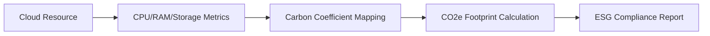
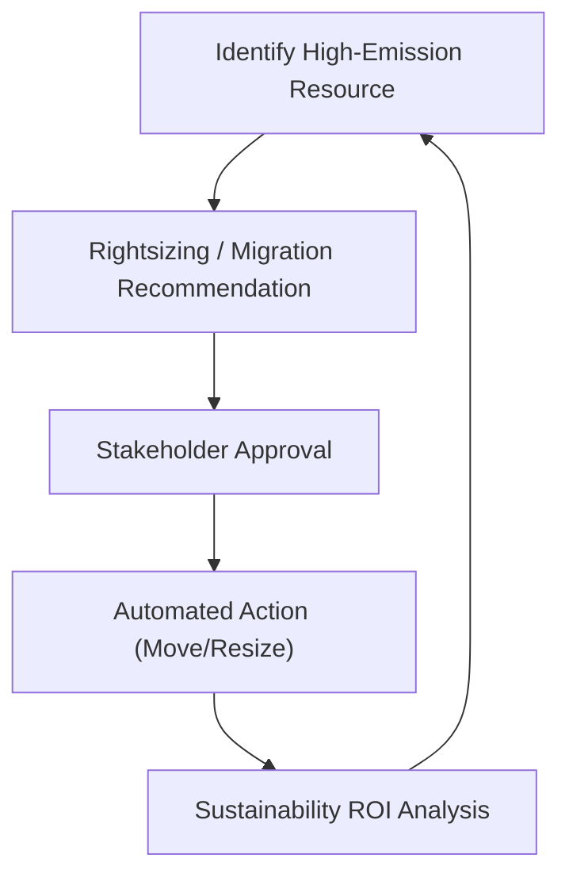
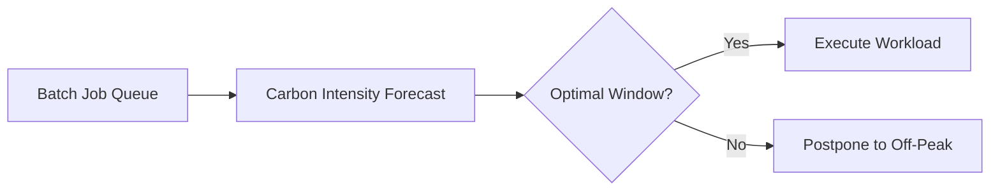
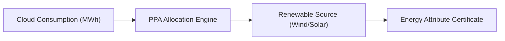
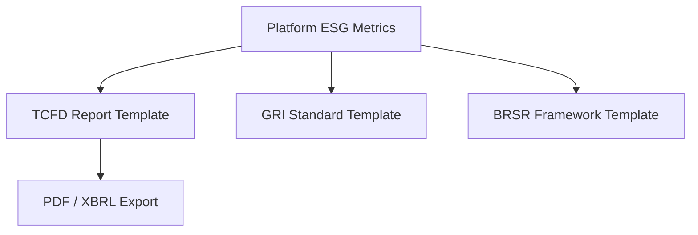
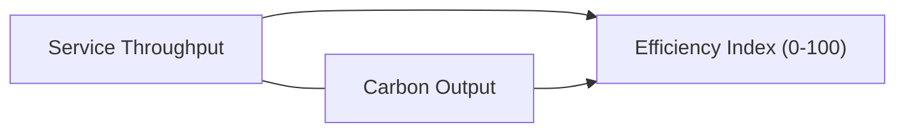
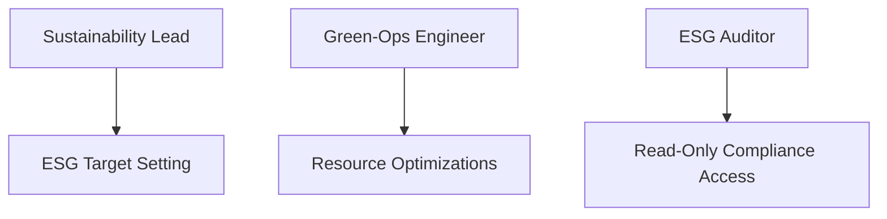
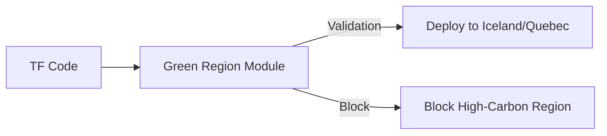
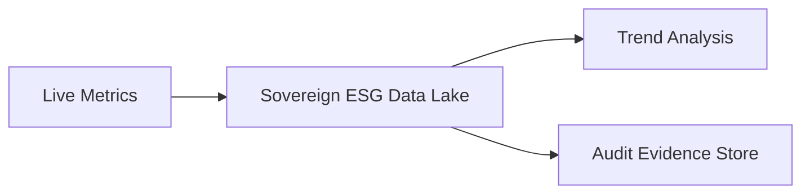

<div align="center">


<h1>Sustainability Landing Zone</h1>

<p><strong>The Strategic Foundation for Carbon-Aware Infrastructure, Resource Efficiency, and Multi-Cloud Sustainability Governance.</strong></p>

[]()
[]()
[]()

<br/>

> **"Sustainability is a primary architectural pillar."** 
> **Sustainability Landing Zone (Sustain-LZ)** is an institutional-grade platform designed to provide a secure, measurable, and highly automated foundation for global cloud sustainability. It orchestrates the entire lifecycle—from carbon-aware workload placement to real-time resource optimization and immutable ESG reporting.

</div>

---

## 🏛️ Executive Summary

Cloud infrastructure is the backbone of the digital economy, but its environmental cost is often hidden. Organizations often fail to meet sustainability targets not because of a lack of intent, but because of fragmented resource visibility and an inability to enforce carbon-aware policies at the foundation level.

This platform provides the **Sustainability Landing Zone Plane**. It implements a complete **Green Infrastructure Framework**, enabling ESG and Platform Engineering teams to manage carbon footprints as a first-class citizen. By automating workload placement and resource optimization, we ensure that the cloud foundation is continuously delivered with strategic environmental precision.

---

## 📐 Architecture Storytelling: Principal Reference Models

### 1. Principal Architecture: Global Sustainability Intelligence Plane
This diagram illustrates the end-to-end flow from multi-cloud resource monitoring to automated carbon-aware scheduling and institutional ESG reporting.

```mermaid
graph LR
    %% Subgraph Definitions
    subgraph MultiCloud["Multi-Cloud Infrastructure"]
        direction TB
        AWS["AWS Resources"]
        Azure["Azure Resources"]
        GCP["GCP Resources"]
    end

    subgraph Ingestion["ESG Data Ingestion Plane"]
        direction TB
        Collector["Resource Usage Collector"]
        CarbonAPI["Regional Carbon Intensity API"]
        Mapper["Sustainability Data Mapper"]
    end

    subgraph Intelligence["Sustainability Intelligence Engine"]
        direction TB
        API["FastAPI Sustainability Gateway"]
        Optimizer["Green-Ops Optimization Engine"]
        Sched["Carbon-Aware Scheduler"]
        Policy["Sustainability Policy Guardrails"]
    end

    subgraph Reporting["Institutional ESG Reporting"]
        direction TB
        Dash["Unified Sustainability Hub"]
        ESG["TCFD / GRI Report Generator"]
        Audit["Immutable Forensic Logs"]
    end

    subgraph DevOps["IaC & Green-Ops Orchestration"]
        direction TB
        GH["GitHub Actions Pipelines"]
        TF["Terraform Sustainability Modules"]
        SRE["Resource Efficiency Scorecard"]
    end

    %% Flow Arrows
    MultiCloud -->|1. Usage Metrics| Collector
    CarbonAPI -->|2. Intensity Data| Mapper
    Collector -->|3. Normalise| Mapper
    Mapper -->|4. Feed| API
    
    API -->|5. Validate| Policy
    Policy -->|6. Trigger| Optimizer
    Optimizer -->|7. Reschedule| Sched
    Sched -->|8. Place Workload| MultiCloud
    
    API -->|9. Visualize| Dash
    Dash -->|10. Generate| ESG
    ESG -->|11. Verify| Audit
    
    GH -->|12. Provision| TF
    TF -->|13. Enforce Region| MultiCloud
    API -->|Scorecard| SRE

    %% Styling
    classDef cloud fill:#f5f5f5,stroke:#616161,stroke-width:2px;
    classDef ingest fill:#fff3e0,stroke:#e65100,stroke-width:2px;
    classDef intel fill:#ede7f6,stroke:#311b92,stroke-width:2px;
    classDef report fill:#fce4ec,stroke:#880e4f,stroke-width:2px;
    classDef devops fill:#fffde7,stroke:#f57f17,stroke-width:2px;

    class MultiCloud cloud;
    class Ingestion ingest;
    class Intelligence intel;
    class Reporting report;
    class DevOps devops;
```



### 2. Carbon Footprint Lifecycle: Resource to Report
The automated path for converting raw technical usage into auditable carbon metrics.



### 3. Green Cloud Optimization Loop
Continuous identification and remediation of inefficient or "dirty" cloud resources.



### 4. Carbon-Aware Workload Scheduling
Windowing logic for executing batch workloads during periods of low grid carbon intensity.



### 5. Renewable Energy Allocation Model
Mapping institutional cloud consumption to Renewable Energy Power Purchase Agreements (PPAs).



### 6. Sustainability Compliance Reporting: ESG Frameworks
Generating regulatory reports as a background process from live platform data.



### 7. Resource Efficiency Scorecard
Visualizing the trade-off between technical performance and environmental impact.



### 8. Identity & RBAC for ESG Ops
Managing who can define sustainability targets and approve green-ops migrations.



### 9. IaC Sustainability Guardrails: Standardizing at Birth
Preventing the deployment of resources in high-carbon regions using Terraform modules.



### 10. Metadata Lake for Forensic ESG Auditing
Storing historical emission and energy data for long-term audit readiness.



---

## 🏛️ Core Platform Pillars

1.  **Carbon-Aware Workload Scheduling**: Strategic engine that places batch workloads in regions and time windows with the lowest carbon intensity.
2.  **Resource Optimization Engine**: Intelligent analysis of utilization patterns to generate rightsizing and termination recommendations.
3.  **Green Networking Architecture**: Policy-driven deployment logic that prefers low-carbon regions and optimizes data transfer.
4.  **Storage Lifecycle Governance**: Automated tiering and retention policies to minimize the energy footprint of long-term data.
5.  **Sustainability Policy Engine**: Real-time enforcement of green-ops standards and organizational carbon budgets.
6.  **Unified ESG Observability**: Deep monitoring of carbon footprints, energy efficiency scores, and cost vs. carbon trade-offs.

---

## 🛠️ Technical Stack & Implementation

### Platform Engine & APIs
*   **Framework**: Python 3.11+ / FastAPI.
*   **Sustainability Engine**: Specialized connectors for Cloud Carbon Footprint and Electricity Maps APIs.
*   **State Management**: PostgreSQL for optimization history and resource metadata.
*   **Orchestration**: Redis for high-speed policy storage and report caching.

### Sustainability Hub (UI)
*   **Framework**: React 18 / Vite.
*   **Theme**: Teal / Slate (Modern Sustainability & Platform Engineering aesthetic).
*   **Visualization**: Recharts for emission trends and efficiency scorecards.

### Infrastructure & DevOps
*   **Runtime**: AWS EKS or Azure Kubernetes Service (AKS).
*   **IaC**: Modular Terraform for deploying the sustainability landing zone and monitoring workers.

---

## 🏗️ IaC Mapping (Module Structure)

| Module | Purpose | Real Services |
| :--- | :--- | :--- |
| **`infrastructure/sustainability`** | The management plane | EKS, PostgreSQL, Redis |
| **`infrastructure/collectors`** | ESG data ingestion nodes | Lambda, Cloud Functions, EventBridge |
| **`infrastructure/guardrails`** | Green-Ops policy enforcement | Azure Policy, AWS Config, SCPs |
| **`infrastructure/reporting`** | Compliance and ESG sinks | S3, Athena, QuickSight |

---

## 🚀 Deployment Guide

### Local Principal Environment
```bash
# Clone the sustainability landing zone
git clone https://github.com/devopstrio/sustainability-lz.git
cd sustainability-lz

# Configure environment
cp .env.example .env

# Launch the Sustainability stack
make up

# Trigger a sustainability resource analysis
make analyze-resources

# Run carbon-aware scheduling logic
make optimize-scheduling
```

Access the Sustainability Hub at `http://localhost:3000`.

---

## 📜 License
Distributed under the MIT License. See `LICENSE` for more information.

---
<div align="center">
  <p>© 2026 Devopstrio. All rights reserved.</p>
</div>
