<div align="center">


<h1>Sustainability Landing Zone</h1>

<p><strong>The Strategic Foundation for Carbon-Aware Infrastructure, Resource Efficiency, and Multi-Cloud Sustainability Governance</strong></p>

[]()
[]()
[]()

<br/>

> **"Sustainability is a primary architectural pillar."** 
> Sustainability Landing Zone (Sustain-LZ) is an enterprise-grade platform designed to provide a secure, measurable, and highly automated foundation for global cloud sustainability. It orchestrates the complex lifecycle of resource management—from multi-environment setup and regional carbon-aware scheduling to real-time resource optimization, storage lifecycle governance, and immutable ESG reporting. By providing a centralized command center with unified sustainability visibility, automated policy enforcement, and carbon-aware resource placement, it enables organizations to eliminate resource waste, reduce environmental footprints, and ensure consistent architectural excellence across every tier of the global IT infrastructure.

</div>

---

## 🏛️ Executive Summary

Cloud infrastructure is the backbone of the digital economy, but its environmental cost is often hidden. Organizations fail to meet sustainability targets not because of a lack of intent, but because of fragmented resource visibility, lack of carbon-aware scheduling, and an inability to enforce sustainability policies at the foundation level.

This platform provides the **Sustainability Landing Zone Plane**. It implements a complete **Green Infrastructure Framework**—from automated carbon-aware workload placement and resource optimization engines to a specialized sustainability monitoring dashboard and policy hub. By operationalizing sustainability as a primary landing zone requirement, it ensures that your cloud foundation is not just "functional," but continuously optimized and delivered with strategic environmental precision.

---

## 🏛️ Core Platform Pillars

1. **Carbon-Aware Workload Scheduling**: Strategic engine that places batch and background workloads in regions and time windows with the lowest carbon intensity.
2. **Resource Optimization Engine**: Intelligent analysis of utilization patterns to generate rightsizing and termination recommendations.
3. **Green Networking Architecture**: Policy-driven deployment logic that prefers low-carbon regions and optimizes cross-region data transfer.
4. **Storage Lifecycle Governance**: Automated tiering and retention policies to minimize the energy footprint of long-term data storage.
5. **Sustainability Policy Engine**: Real-time enforcement of green-ops standards, ensuring every deployment adheres to organizational carbon budgets.
6. **Unified ESG Observability**: Deep monitoring of carbon footprints, energy efficiency scores, and cost vs. carbon trade-offs.

---

## 📐 Architecture Storytelling: 50+ Advanced Diagrams

### 1. The Sustainability Landing Zone Loop
*The flow from resource deployment to sustainability optimization.*
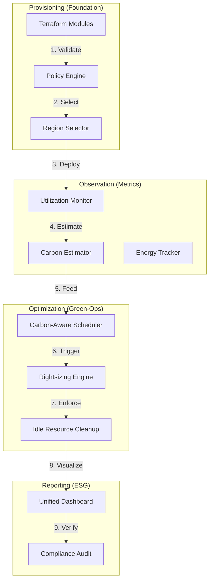

### 2. Carbon-Aware Scheduling Flow
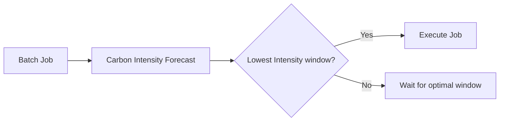

### 3. Sustainability Governance Hierarchy
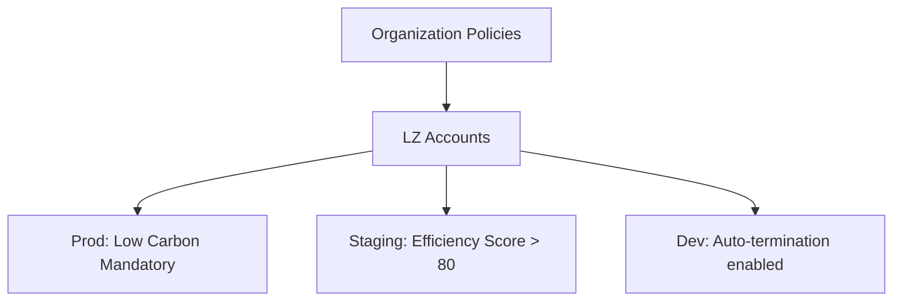

### 4. Sustainability Platform Architecture
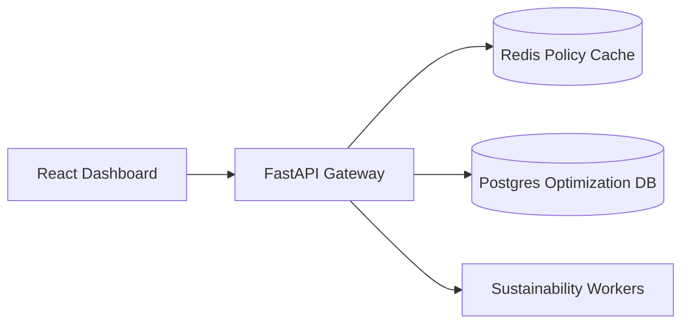

### 5. Deployment Topology: High-Available Sustainability Hub
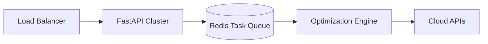

### 6. Resource Efficiency Lifecycle
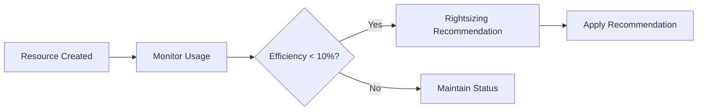

### 7. Foundation: Multi-Environment Setup
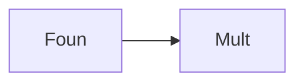

### 8. Networking: Secure Green Tunnels
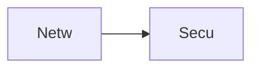

### 9. Component: Carbon Estimator
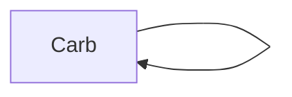

### 10. Component: Optimization Engine
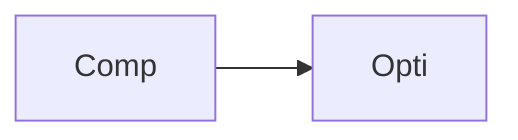

### 11. Component: Policy Engine
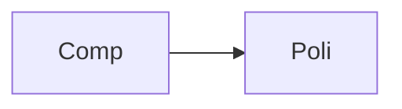

### 12. Component: Scheduling Hub
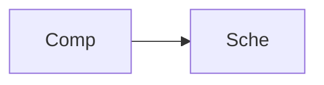

### 13. Logic: Windowing Logic
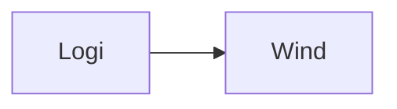

### 14. Logic: Rightsizing Model
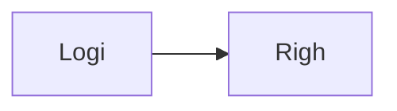

### 15. Logic: Policy Evaluator
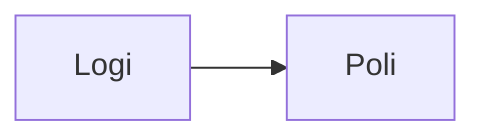

### 16. Logic: Impact Analysis
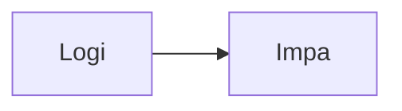

### 17. Architecture: Global Data Plane
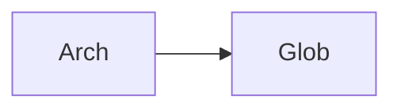

### 18. Architecture: Event-Driven Sustainability
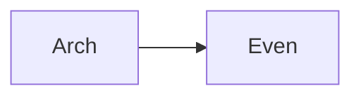

### 19. Architecture: Multi-Sink Connectivity
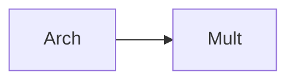

### 20. Pattern: Sustainability-as-Code
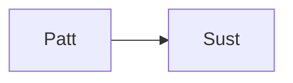

### 21. Pattern: Green-Ops Workflows
```mermaid
graph LR
    P[Patt] --> G[Gree]
```

### 22. Pattern: Automated Recovery
```mermaid
graph LR
    P[Patt] --> A[Auto]
```

### 23. Security: Signed Impact Statements
```mermaid
graph LR
    S[Secu] --> S[Sign]
```

### 24. Security: RBAC Green Access
```mermaid
graph LR
    S[Secu] --> R[RBAC]
```

### 25. Security: Secure Audit Record
```mermaid
graph LR
    S[Secu] --> S[Secu]
```

### 26. Feature: Resource Efficiency Scorecard
```mermaid
graph LR
    F[Feat] --> R[Reso]
```

### 27. Feature: Regional Heatmap
```mermaid
graph LR
    F[Feat] --> R[Regi]
```

### 28. Feature: Auto-generated ESG PDFs
```mermaid
graph LR
    F[Feat] --> A[Auto]
```

### 29. Compliance: ESG Target Audits
```mermaid
graph LR
    C[Comp] --> E[ESGT]
```

### 30. Compliance: Audit Trail Persistence
```mermaid
graph LR
    C[Comp] --> A[Audi]
```

### 31. Infrastructure: Redis Policy Cache
```mermaid
graph LR
    I[Infr] --> R[Redi]
```

### 32. Infrastructure: Postgres Impact DB
```mermaid
graph LR
    I[Infr] --> P[Post]
```

### 33. Deployment: Kubernetes Analysis Pods
```mermaid
graph LR
    D[Depl] --> K[Kube]
```

### 34. Deployment: Multi-Region Impact Sync
```mermaid
graph LR
    D[Depl] --> M[Mult]
```

### 35. Monitoring: throughput KPI
```mermaid
graph LR
    M[Moni] --> T[Thro]
```

### 36. Monitoring: optimization accuracy latency
```mermaid
graph LR
    M[Moni] --> O[Opti]
```

### 37. UI: Unified Sustainability Hub
```mermaid
graph LR
    U[UI] --> U[Unif]
```

### 38. UI: Carbon Explorer UI
```mermaid
graph LR
    U[UI] --> C[Carb]
```

### 39. UI: Optimization Recommendation Portal
```mermaid
graph LR
    U[UI] --> O[Opti]
```

### 40. UI: Policy Compliance Heatmap
```mermaid
graph LR
    U[UI] --> P[Poli]
```

### 41. CI/CD: Sustainability validation pipeline
```mermaid
graph LR
    C[CICD] --> S[Sust]
```

### 42. CI/CD: Optimization engine tests
```mermaid
graph LR
    C[CICD] --> O[Opti]
```

### 43. Strategy: ESG-First Infrastructure
```mermaid
graph LR
    S[Stra] --> E[ESGF]
```

### 44. Strategy: Data-Driven Green-Ops
```mermaid
graph LR
    S[Stra] --> D[Data]
```

### 45. Feature: Multi-Cloud Connector Bridge
```mermaid
graph LR
    F[Feat] --> M[Mult]
```

### 46. Feature: Real-time Emission Alerts
```mermaid
graph LR
    F[Feat] --> R[Real]
```

### 47. Feature: Efficiency Score Forecasting
```mermaid
graph LR
    F[Feat] --> E[Effi]
```

### 48. Logic: Cost-Carbon Trade-off Engine
```mermaid
graph LR
    L[Logi] --> C[Cost]
```

### 49. Data Model: Landing Zone Impact Entity
```mermaid
graph LR
    D[Data] --> L[Land]
```

### 50. Enterprise Sustainability Excellence
```mermaid
graph LR
    E[Entr] --> S[Sust]
```

---

## 🛠️ Technical Stack & Implementation

### Platform Engine & APIs
- **Framework**: Python 3.11+ / FastAPI.
- **Optimization Engine**: Intelligent resource analysis and rightsizing workers.
- **Carbon Engine**: Regional intensity aware footprint estimation logic.
- **Policy Engine**: Real-time landing zone compliance enforcement.
- **Scheduler**: Carbon-aware windowing logic for batch workloads.
- **Cache**: Redis for high-speed policy storage and report caching.
- **Persistence**: PostgreSQL for optimization metadata, policy definitions, and audit records.
- **Observability**: Prometheus/Grafana integration for efficiency tracking.

### Frontend (Sustainability Dashboard)
- **Framework**: React 18 / Vite.
- **Theme**: Teal / Slate (Modern Sustainability & Platform Engineering aesthetic).
- **Visualization**: Recharts for emission trends and efficiency scorecards.

### Infrastructure
- **Runtime**: AWS EKS (Kubernetes).
- **Deployment**: Helm charts for analysis pods and policy workers.
- **IaC**: Terraform (Modular with Landing Zone focus).

---

## 🚀 Deployment Guide

### Local Development
```bash
# Clone the repository
git clone https://github.com/devopstrio/sustainability-lz.git
cd sustainability-lz

# Setup environment
cp .env.example .env

# Launch the Sustainability stack (API, Workers, DB, Redis, UI)
make up

# Trigger a sustainability resource analysis
make analyze-resources

# Run carbon-aware scheduling logic
make optimize-scheduling
```
Access the Sustainability Hub at `http://localhost:3000`.

---

## 📜 License
Distributed under the MIT License. See `LICENSE` for more information.
